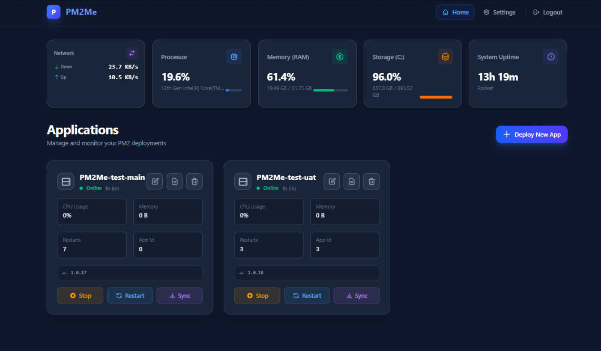

# PM2Me 🚀

> A self-hosted, premium web dashboard for deploying and managing Node.js applications via PM2.

PM2Me lets you **deploy apps directly from a GitHub repository**, manage PM2 processes, monitor your server in real-time, and receive webhook-triggered auto-deployments — all from a beautiful, dark-mode UI.

[](https://buymeacoffee.com/rocketx.x)



---

## ✨ Features

| Feature | Details |
|---|---|
| 🖥 **Dashboard** | View all PM2 apps with real-time status, CPU, memory, uptime |
| 🚀 **Deploy from GitHub** | Clone & deploy any GitHub repo with PAT authentication |
| 🔄 **Auto-Sync via Webhook** | Automatically re-deploy on `git push` using GitHub Webhooks |
| 📊 **Server Monitor** | Real-time CPU, RAM, Disk, Network, and System Uptime via Socket.IO |
| 📜 **Live Logs** | Stream PM2 app logs in the browser in real-time |
| 🔔 **Notifications** | Deployment alerts via Discord Webhook or Telegram Bot |
| 🔐 **Admin Login** | Secure JWT-based authentication with bcrypt hashed passwords |
| ⚙️ **Settings Page** | Manage GitHub accounts, webhook secrets, and notification integrations |
| 📋 **Webhook History** | Last 50 webhook events logged and updated in real-time |
| 🗑 **Delete/Stop/Restart** | Full PM2 lifecycle management with a premium custom UI |

---

## 🧱 Tech Stack

**Backend**
- [Express.js](https://expressjs.com/) — REST API server
- [Socket.IO](https://socket.io/) — Real-time log streaming & system stats
- [PM2](https://pm2.keymetrics.io/) — Process management (`pm2` Node.js API)
- [LowDB](https://github.com/typicode/lowdb) — Lightweight JSON file database
- [bcrypt](https://www.npmjs.com/package/bcrypt) — Password hashing
- [jsonwebtoken](https://www.npmjs.com/package/jsonwebtoken) — JWT Auth
- [simple-git](https://github.com/steveukx/git-js) — Git operations

**Frontend**
- [Vue 3](https://vuejs.org/) — Reactive UI
- [Vite](https://vitejs.dev/) — Build tool
- [Socket.IO Client](https://socket.io/docs/v4/client-api/) — Real-time updates

---

## 🚀 Getting Started

### Prerequisites
- [Node.js](https://nodejs.org/) >= 18
- [PM2](https://pm2.keymetrics.io/) installed globally: `npm install -g pm2`
- [Git](https://git-scm.com/) installed and accessible in `PATH`

### Installation & Running (Recommended with PM2)

```bash
# 1. Clone the repository
git clone https://github.com/drocketxx/PM2Me.git
cd PM2Me

# 2. Install all dependencies (frontend + backend)
npm run install:all

# 3. Build the frontend
npm run build

# 4. Start PM2Me with PM2 ✅ Recommended
cd backend
pm2 start app.js --name pm2me

# 5. Auto-start on system reboot
pm2 save
pm2 startup
```

Open your browser at: **http://localhost:12345**

> 💡 **Useful PM2 commands:**
> ```bash
> pm2 status          # Check PM2Me status
> pm2 logs pm2me      # View PM2Me logs
> pm2 restart pm2me   # Restart PM2Me
> pm2 stop pm2me      # Stop PM2Me
> ```

**Development mode** (nodemon auto-restart):
```bash
cd /path/to/PM2Me
npm run dev
```

---

## 🔐 Default Login & Password Management

On first run, **no password is set**. Use the CLI to set one:

```bash
# Set or change admin password
npm run pw -- <your_password>

# Example
npm run pw -- mySecretPass123
```

> You can also run it directly from the `backend/` folder:
> ```bash
> cd backend && node scripts/change-password.js mySecretPass123
> ```
>
> The password is stored as a **bcrypt hash** (12 rounds) in `backend/db/database.json`.

---

## 🔗 GitHub Webhook Setup

PM2Me supports automatic deployments triggered by `git push`. Here's how to enable it:

1. Go to your GitHub repository → **Settings** → **Webhooks** → **Add webhook**
2. Set **Payload URL** to: `http://your-server-ip:12345/api/webhook`
3. Set **Content type** to: **`application/json`** ⚠️
4. Set **Secret** from the Settings page in PM2Me (generate one if needed)
5. Select **Just the push event**
6. Click **Add webhook**

PM2Me will automatically re-deploy any matching app (matched by repo URL + branch) on each push.

> **Webhook History** (last 50 events) is displayed on the Settings page in real-time.

---

## 📂 Project Structure

```
PM2Me/
├── backend/
│   ├── app.js              # Express server + Socket.IO setup
│   ├── db/
│   │   ├── index.js        # LowDB initialization
│   │   └── database.json   # App data, settings, webhook logs
│   ├── routes/
│   │   ├── api.js          # Main API routes
│   │   └── auth.js         # Login / JWT auth
│   ├── services/
│   │   ├── gitService.js   # Git clone/pull operations
│   │   ├── pm2Service.js   # PM2 process management
│   │   ├── systemService.js# CPU / RAM / Disk / Network stats
│   │   └── notificationService.js # Discord & Telegram alerts
│   ├── scripts/
│   │   └── change-password.js  # CLI tool to change admin password
│   └── public/             # Built Vue frontend (served statically)
├── frontend/
│   ├── src/
│   │   ├── views/
│   │   │   ├── Dashboard.vue   # Main app dashboard
│   │   │   ├── Settings.vue    # Settings & webhook history
│   │   │   └── Login.vue       # Auth page
│   │   ├── components/
│   │   │   ├── DeployModal.vue # New/Edit app deployment modal
│   │   │   ├── LogViewer.vue   # Real-time log stream
│   │   │   └── ServerStats.vue # CPU/RAM/Network widget
│   │   ├── router/             # Vue Router config
│   │   └── App.vue             # Nav layout
│   └── vite.config.js
├── apps/                   # Cloned app repos live here
└── package.json            # Root scripts (dev, build, pw)
```

---

## 📝 Available Scripts

Run these from the **root** `PM2Me/` directory:

| Command | Description |
|---|---|
| `npm run dev` | Build frontend & start backend dev server |
| `npm run build` | Build frontend only |
| `npm run pw -- <password>` | Change admin password |
| `npm run install:all` | Install all dependencies (root + frontend + backend) |

---

## 📡 API Overview

| Method | Endpoint | Description |
|---|---|---|
| `POST` | `/api/auth/login` | Login, returns JWT token |
| `GET` | `/api/pm2/list` | List all PM2 processes |
| `POST` | `/api/pm2/:action` | PM2 action: start/stop/restart/delete |
| `GET` | `/api/apps` | List all deployed apps (DB) |
| `POST` | `/api/apps` | Register a new app |
| `PUT` | `/api/apps/:id` | Update app config |
| `DELETE` | `/api/apps/:id` | Delete app from DB |
| `POST` | `/api/apps/:id/deploy` | Trigger deployment |
| `GET` | `/api/apps/:id/sync-status` | Check if branch is behind remote |
| `GET` | `/api/settings` | Get current settings |
| `POST` | `/api/settings` | Save settings |
| `GET` | `/api/settings/webhook-logs` | Get last 50 webhook events |
| `POST` | `/api/webhook` | GitHub Webhook receiver |
| `GET` | `/api/system/stats` | Server system stats |

---

## 📦 Deployment (Production)

For production, it's recommended to run the PM2Me backend itself with PM2:

```bash
# Build the frontend
npm run build

# Start with PM2
cd backend
pm2 start app.js --name pm2me

# Save and set to auto-restart on reboot
pm2 save
pm2 startup
```

---

## 🛡 Security Notes

- Change the default admin password immediately on first run using `npm run pw`.
- Set a strong `JWT_SECRET` in your `.env` file.
- Always set a **Webhook Secret** to prevent unauthorized deploys.
- Consider putting PM2Me behind a reverse proxy (e.g., Nginx) with HTTPS in production.

---

## 📄 License

MIT
